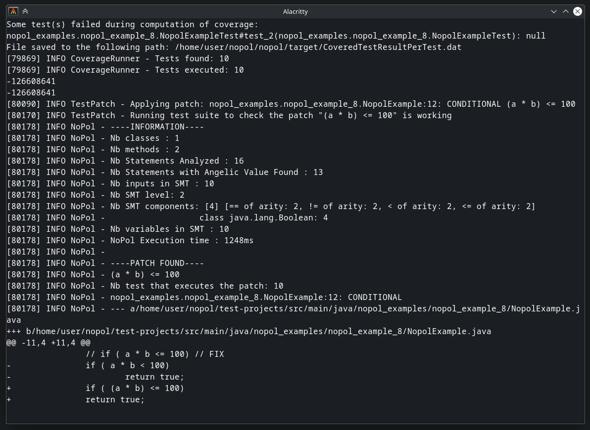
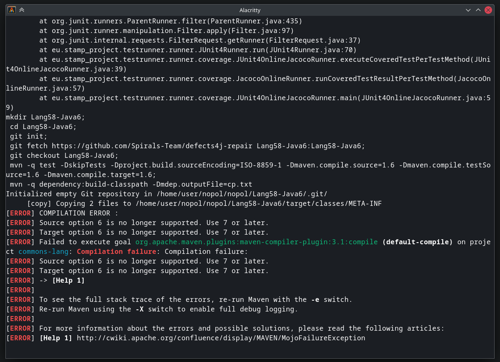
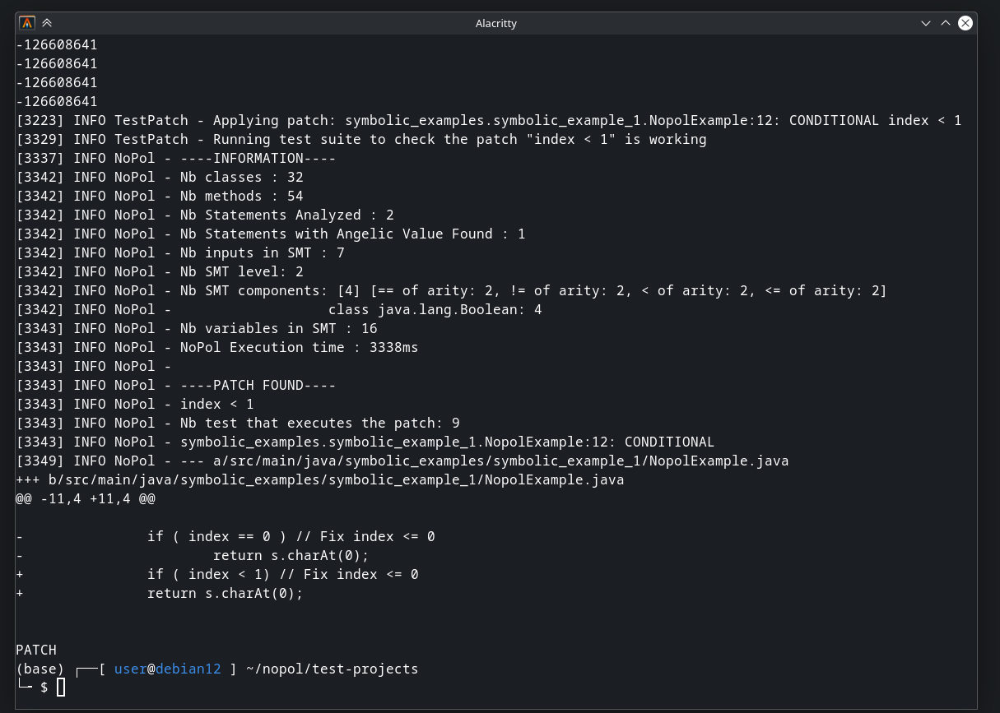

Name: Wasique Islam Shafin 

ID: 40304330

# 1. Nopol: An automatic software repair tool for Java
## Install (Debian12-x86_64)
```bash
sudo apt update
sudo apt install -y openjdk-17-jdk maven git z3

# Set Up Environment Variables
export JAVA_HOME=/usr/lib/jvm/java-17-openjdk-amd64
export PATH=$JAVA_HOME/bin:$PATH

# Clone and Build Nopol
git clone https://github.com/SpoonLabs/nopol.git
cd nopol/nopol
mvn package -DskipTests

# Find JAR file With Dependencies
ls target/*jar # target/nopol-0.2-SNAPSHOT-jar-with-dependencies.jar

# Compile the Test Projects
cd ../test-projects/
# compiling app (in target/classes) and tests (in target/test-classes), but don't run the tests (they obviously fail, because the goal is to repair them)
mvn test -DskipTests 
```

## a. Run Nopol 
### Command
```bash
# Run tests of Nopol to check install
cd ../nopol/
mvn test
```

### Output: 
Example Successfull Patches: 
- The builtin tests passes and generated the patches successfullly

Example Failed Compilation: 
- These failed compilation occur when the projects are very old and use very old Java Versions (Java 5, Java 6 & Java 7)

## b. Run Test-Projects (Dataset)
### Command
```bash
# Run Nopol
cd ../test-projects/
java -jar ../nopol/target/nopol-0.2-SNAPSHOT-jar-with-dependencies.jar   -s src/main/java/   -c target/classes:target/test-classes:/home/user/.m2/repository/junit/junit/4.11/junit-4.11.jar:/home/user/.m2/repository/org/hamcrest/hamcrest-core/1.3/hamcrest-core-1.3.jar   -t symbolic_examples.symbolic_example_1.NopolExampleTest   -p ../nopol/lib/z3/z3_for_linux
```

### Output

- The output after running the test-projects closely match to that of in the Nopol [Readme](https://github.com/SpoonLabs/nopol/?tab=readme-ov-file#getting-started)

# 2. Why Nopol?
I have chosen Nopol because it is a mature yet actively maintained tool (last updated five months ago). It runs on modern systems, and due to its simpler nature, integrating and augmenting it may be easier. Additionally, its README is highly detailed, and multiple studies (three) have been conducted using Nopol.

# 3. Research Questions (RQ)
### RQ1: Which bugs of Defect4J can automatically be patched with Nopol?
Defects4J is a large, stable collection of bugs from various diverse and extensive Java open-source projects. Most of these bugs include test suites and can be executed independently. It would be interesting to determine how many and which of these bugs can be fixed by Nopol.

### RQ2: Are the Nopol patches readable and reliable?
A simple patch is more likely to be accepted by the developers. In this instance, we can look at the complexity and number of expressions like variables, literals, loops, parameters, method calls and operators in each patch. Moreover, we can also check whether the patches for a bug are the same when run multiple times.

### RQ3: Are Nopol patches better than LLM generated ones?
Nopol is specially built for fixing conditional bugs and needs a success and a failing test case to generate patches, however an LLM could generate patches by source code alone. It can be interesting to see the effectiveness of LLM in generating the patches and compete with Nopol or improve upon the patches of Nopol by augmenting it.

# 4. Evaluation Plan
| RQ      | Steps                                                                                                                                                                                                                                                                                                                                                     | Time Required |
| ------- | --------------------------------------------------------------------------------------------------------------------------------------------------------------------------------------------------------------------------------------------------------------------------------------------------------------------------------------------------------- | ------------- |
| **RQ1** | 1. Set up Defects4J and ensure all dependencies are installed.  <br> 2. Select a subset of Defects4J bugs covering different projects.  <br> 3. Run Nopol on each selected bug and record which ones are successfully patched.  <br> 4. Analyze the characteristics of the patched vs. unpatched bugs.  <br> 5. Summarize findings and generate a report. | ~2 weeks      |
| **RQ2** | 1. Collect patches generated by Nopol from RQ1.  <br> 2. Analyze complexity by measuring expressions (e.g., number of variables, literals, loops, operators, method calls).  <br> 3. Run Nopol multiple times on the same bugs to check for patch consistency.  <br> 4. Compare patches with manually written ones.                                       | ~1 week       |
| **RQ3** | 1. Program an LLM to be capable of generating patches like Nopol.  <br> 2. Generate patches for the same bugs used in RQ1.  <br> 3. Compare LLM patches with Nopol patches based on correctness, readability, and complexity.  <br> 4. Evaluate if LLM patches can augment or improve Nopol’s patches.                                                    | ~2 weeks      |

# 5. References
[Nopol: Automatic Repair of Conditional Statement Bugs in Java Programs](https://hal.archives-ouvertes.fr/hal-01285008/document) (Jifeng Xuan, Matias Martinez, Favio Demarco, Maxime Clément, Sebastian Lamelas, Thomas Durieux, Daniel Le Berre, Daniel Le Berre, Martin Monperrus). IEEE Transactions on Software Engineering, 2016.